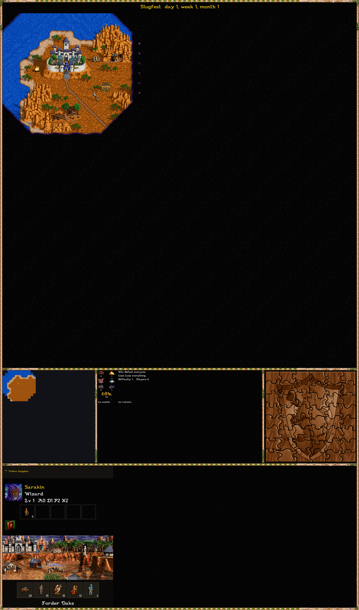
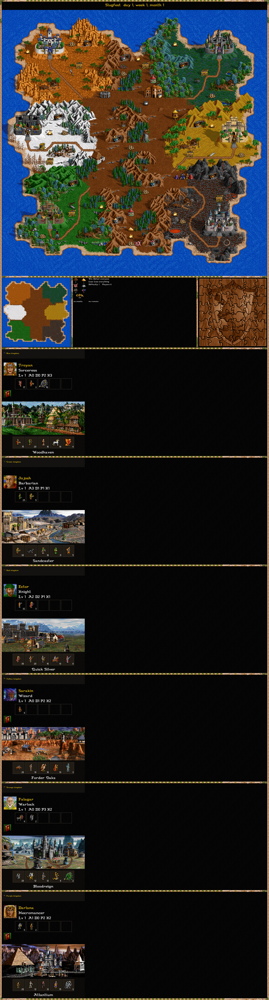

# homm2-screenshot

[](https://github.com/slavamokerov/homm2-screenshot/actions/workflows/build.yml)
[](LICENSE)

**[Try it online](https://slavamokerov.github.io/homm2-screenshot/)** — the same renderer compiled to WebAssembly.

A command-line tool and a browser page that render a **Heroes of Might and
Magic II** save (or an **fheroes2** save) into a poster PNG:

- the adventure map, with the fog of war of one player or without it;
- castle screens (the town view and the garrison);
- hero cards (portrait, class, level, army, artifacts);
- info panels: minimap, resources, calendar, rumors, the obelisk puzzle and the
  win/loss conditions.

In the browser the game data (about 46 MB of `HEROES2.AGG`) is read from the
local disk; nothing is uploaded.

## Screenshots

| With fog of war (36×36 map) | Without fog (36×36, HoMM2 save) |
|---|---|
|  |  |

## Input

- **fheroes2** saves: `.sav`, `.savc`, `.savm`, `.savh` (formats 10032–10034).
- **Original HoMM2** saves: `.GM1` (standard games), `.GMC` (The Succession Wars
  campaigns), `.GXC` (The Price of Loyalty campaigns). They are converted in
  memory by [homm2-to-fheroes2](https://github.com/slavamokerov/homm2-to-fheroes2)
  before rendering.

Rendering needs the game resources: `HEROES2.AGG` (and `HEROES2X.AGG` for The
Price of Loyalty). Point the tool at the folder that contains them.

## Building from source

Requires CMake ≥ 3.21, Qt6 (Core, Gui), ZLIB and a C++17 compiler.

```bash
cmake -S . -B build
cmake --build build
./build/homm2-screenshot <save> --out poster.png
```

The save parser and the game-resource loader in `vendor/fh2core/` are shared
with [fheroes2-save-editor](https://github.com/slavamokerov/fheroes2-save-editor)
and synced with `scripts/sync-core.sh`; the HoMM2 converter in `vendor/h2core/`
is synced with `scripts/sync-h2core.sh`.

## Command line

| Option | Meaning |
|---|---|
| `--out <f.png>` | output file (default `poster.png`) |
| `--fog auto\|color:N\|none` | fog of war mode (default `auto`) |
| `--scale 1\|1.5\|2` | map scale multiplier (default `2`) |
| `--dpi <n>` | PNG DPI metadata (default `300`) |
| `--layout <name\|file.json>` | layout: `cardushe` or a JSON layout file |
| `--blocks <list>` | enabled blocks: `map,castles,heroes,chips,title` |
| `--chips <list>` | enabled chips: `minimap,resources,calendar,rumors,puzzle,victory` |
| `--routes none\|player\|visible\|all` | hero route arrows (default `all`) |
| `--data-dir <folder>` | folder with `HEROES2.AGG` (default auto-detect) |

Development diagnostics: `--crop x,y,w,h`, `--castle [N]`, `--hero <id>`,
`--chip <name>`, `--icn name:idx`, `--icnsheet name:from:to:cols`,
`--dump-layout <preset>`.

## Web build

The browser version is the same render code compiled with plain **Emscripten**
(no Qt for WebAssembly): a small software reimplementation of the Qt primitives
the renderer uses lives in `libs/rastercompat/`, so the shared code compiles
unchanged under `em++`.

```bash
./web/build.sh          # -> web/deploy/ (fh2poster.js + .wasm + index.html)
node web/run_node.cjs <save> HEROES2.AGG HEROES2X.AGG out.png '{"fog":"auto","scale":2}'
```

## Printing

The downloaded PNG carries 300 DPI metadata, so its physical size is exact.
Approximate sizes (the height depends on how many kingdoms and cards the save
has):

| Map | Scale | Size | Paper |
|---|---|---|---|
| 36×36 | ×2 | 198×377 mm | A3 |
| 72×72 | ×2 | 393×576 mm | A2 |
| 108×108 | ×2 | 588×733 mm | A1 |
| 144×144 | ×2 | 783×932 mm | A0 |
| 36×36 | ×1 | 99×188 mm | A5 |
| 72×72 | ×1 | 196×288 mm | A4 |
| 108×108 | ×1 | 294×367 mm | A3 |
| 144×144 | ×1 | 391×466 mm | A2 |
| any | ×2 | taller than 1189 mm | custom — over A0 |

On the web page the “Print / Save as PDF” button contain-fits the poster to the
recommended sheet: it touches the sheet edges on the limiting side (usually the
height) and is centered on the other (~270 DPI effective). Print at Scale 100%
(disable “fit to page”); the hint next to the button names the paper format.

## Where the game data is

Pick the folder that contains `HEROES2.AGG` (`HEROES2X.AGG` for The Price of
Loyalty). The web page scans the selected folder recursively, so saves in
subfolders are found too.

| Game | Platform | Example path |
|---|---|---|
| HoMM2 (GOG) | Windows | `C:\GOG Games\HoMM2 Gold` |
| HoMM2 (GOG Galaxy) | Windows | `C:\Program Files (x86)\GOG Galaxy\Games\Heroes of Might and Magic 2 Gold` |
| HoMM2 (CD) | Windows | `C:\HEROES2` |
| HoMM2 (DOSBox) | any | the folder mounted as `C:` (e.g. `C:\DOSGAMES\HEROES2`); saves are in the `GAMES` subfolder next to `HEROES2.AGG` |
| HoMM2 (GOG) | macOS | `/Applications/Heroes of Might and Magic II.app/Contents/Resources` |
| HoMM2 (Wine/Proton) | Linux | `~/.wine/drive_c/HEROES2` |
| fheroes2 | Windows | `%APPDATA%\fheroes2` |
| fheroes2 | macOS | `~/Library/Application Support/fheroes2` |
| fheroes2 | Linux | `~/.local/share/fheroes2` |
| fheroes2 (Flatpak) | Linux | `~/.var/app/io.github.ihhub.Fheroes2/data/fheroes2` |

## Credits

Parts of the renderer are ports of [fheroes2](https://github.com/ihhub/fheroes2)
(GPL-2.0): the ADVBORD interface frame, the fog-of-war tiles, the castle and
hero screens. The mini-Qt used by the web build lives in `libs/rastercompat/`.

The web page is styled with [98.css](https://github.com/jdan/98.css) by Jordan
Scales (MIT) and the “Pixelated MS Sans Serif” font by “lou”
([Fontstruct](https://fontstruct.com/fontstructions/show/1384746), CC BY-SA 3.0);
see `web/LICENSE-98.css` and `web/LICENSE-ms-sans-serif.txt`.

## License

GPL-2.0 — see [LICENSE](LICENSE). Heroes of Might and Magic II is a trademark
of its respective owners; this project is not affiliated with them.
